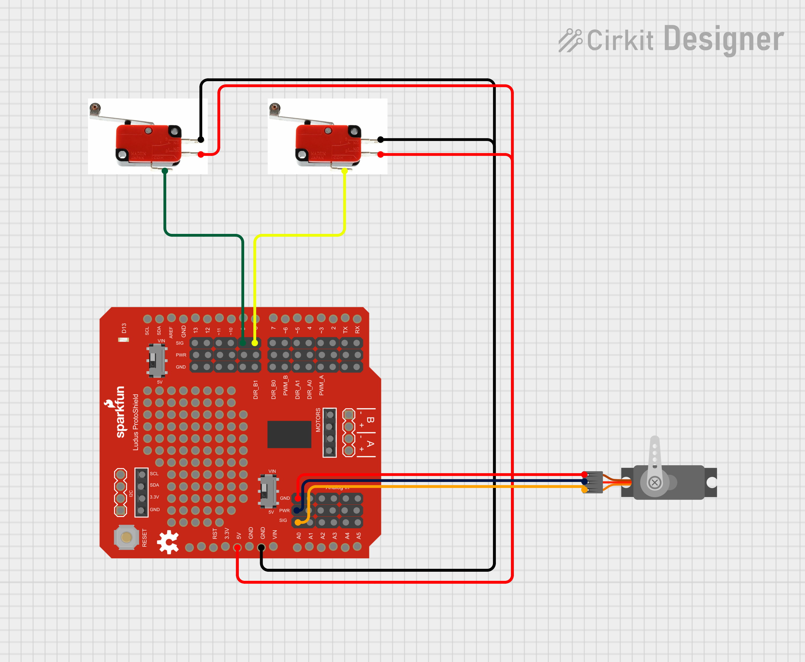
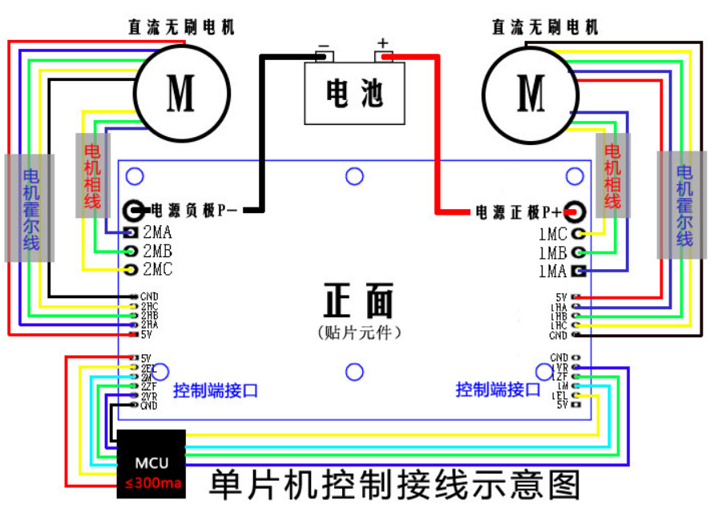
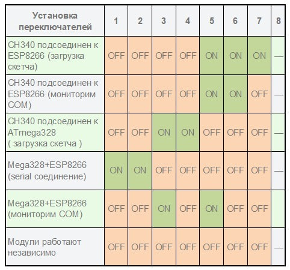
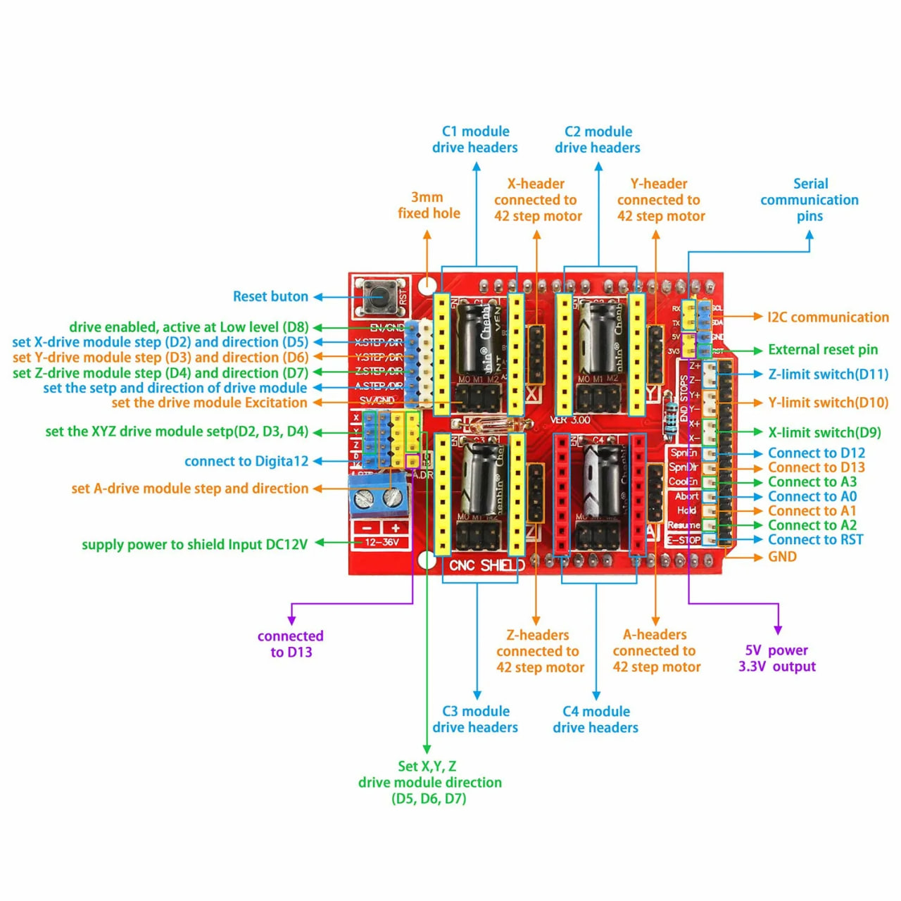
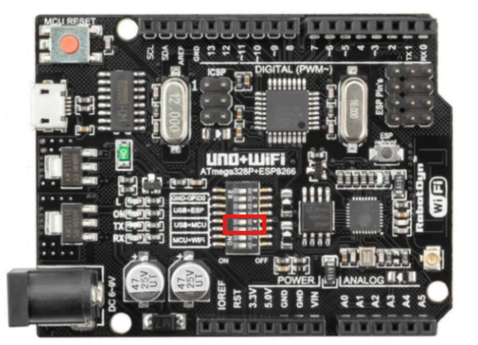

# Тележка

Подключение устройств к плате представлено на рисунке ниже (моторы не удалось запустить от имеющегося БП, поэтому он не был интегрирован). Используются 2 скетча: _cart/cart_control.ino_ и _cart/cart_wifi.ino_. Они загружаются на чипы ATMega и ESP8266 соответственно (см. разделы [Загрузка скетча на чип ATMega](#загрузка-скетча-на-чип-atmega) и [Загрухка скетча на чип ESP8266](#загрухка-скетча-на-чип-esp8266)). После загрузки скриптов необходимо настроить плату на внутреннее взаимодействие, см. раздел [Настройка платы для внутреннего взаимодействия](#настройка-платы-для-внутреннего-взаимодействия).

# Бункер

Подключение устройств к плате представлено на рисунке ниже. Используется 2 скетча: _bunker/bunker_control.ino_ и _bunker/bunker_wifi.ino_. Они загружаются на чипы ATMega и ESP8266 соответственно (см. разделы [Загрузка скетча на чип ATMega](#загрузка-скетча-на-чип-atmega) и [Загрухка скетча на чип ESP8266](#загрухка-скетча-на-чип-esp8266)). После загрузки скриптов необходимо настроить плату на внутреннее взаимодействие, см. раздел [Настройка платы для внутреннего взаимодействия](#настройка-платы-для-внутреннего-взаимодействия).

# Пример с моторами

Подключение мотора и питание к драйверу двигателей представлено на рисунке ниже. Также на проводах есть бирки с первой буквой названия цвета, к которому нужно подключить

Подключение драйвера к плате представлено на рисунке ниже. Используемыый скетч - _motors/motor_ramp.ino_.

# Приложения

## Описание переключателей на плате UNO Wi-Fi

## Описание CNC Shield

## Загрухка скетча на чип ESP8266

Пример загрузки программы в чип ESP8266 представлен в файле [Arudino Wifi - пример.pdf](./Arudino%20Wifi%20-%20пример.pdf).

## Загрузка скетча на чип ATMega

Для загрузки скетча на чип ATMega необходимо перевести переключатели 3 и 4 в положение ON (вверх), а остальные в OFF (вниз). После этого можно загружать скетч, выбрав в Arduino IDE плату Arduino UNO

## Настройка платы для внутреннего взаимодействия

Для того, чтобы чипы ATMega и ESP8266 между собой общались, необходимо настроить переключатели 1 и 2 на плате в положении ON (вверх), остальные в OFF (вниз), в скетче взаимодействие идет через Serial порт, т.е. оба чипа должны читать и отправлять сигналы в Serail порт, при этом отслеживать их вывод через Arduino IDE не получится.

