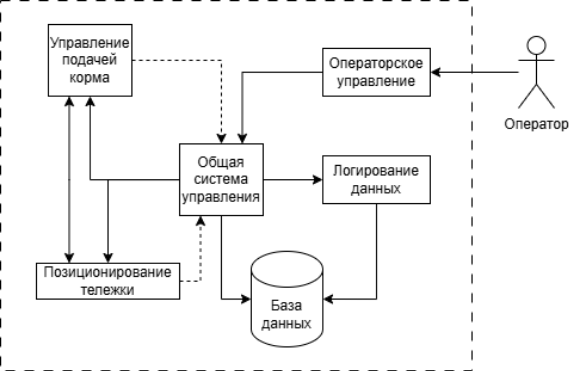

# Описание продукта: Автоматизированная система управления кормлением рыб (АСУ КР)

## Общее описание

Автоматизированная система управления кормлением рыб (АСУ КР) — это комплексное решение для автоматизации процесса кормления рыбы в бассейнах. Система обеспечивает точное дозирование корма, автоматическое перемещение тележки между бассейнами и бункерами, а также полный контроль и мониторинг процесса кормления через веб-интерфейс.

## Основные компоненты системы

### Тележка

Тележка представляет собой мобильную платформу для транспортировки корма от бункеров к бассейнам. В настоящее время разрабатывается макет тележки, включающий следующие компоненты:

- **Двигатель**: мотор от гироскутера для обеспечения движения
- **Каркас**: деревянная конструкция, обеспечивающая прочность и легкость
- **Ходовая часть**: мебельные ролики для перемещения по монорельсу (деревянный брусок), под роликами также установлен деревянный брусок
- **Конструктивные элементы**: пластиковые трубы для формирования структуры
- **Система управления**: Arduino для контроля движения и позиционирования

Тележка перемещается по монорельсу (деревянному бруску) и оснащена системой позиционирования с точностью до 5 см, RFID-ридером для идентификации бассейнов и бункеров, а также датчиками препятствий для обеспечения безопасности движения.

### Бункер

Бункер предназначен для хранения и дозированной подачи корма. Разрабатываемый макет бункера включает:

- **Корпус**: пластиковые трубы, образующие емкость для хранения корма
- **Механизм подачи**: шнековый механизм, распечатанный на 3D-принтере, обеспечивающий равномерную подачу корма
- **Система взвешивания**: пьезодатчики на базе Arduino для точного измерения массы корма (точность не менее 5 г)
- **Конструкция**: весь механизм подачи собран на пластиковых трубах

Бункер обеспечивает автоматическую остановку подачи корма при достижении заданной массы с погрешностью не более 3% в течение 2 секунд.

### Веб-интерфейс

Веб-интерфейс представляет собой интуитивно понятное веб-приложение для управления всей системой кормления. Интерфейс обеспечивает:

- **Управление задачами кормления**: создание, редактирование, удаление и планирование задач кормления с настройкой параметров (бассейн, тип корма, масса, период)
- **Мониторинг в реальном времени**: отображение статуса системы, текущих операций и состояния оборудования
- **Просмотр и фильтрация логов**: детальное логирование всех операций с возможностью фильтрации по типу, дате и другим параметрам
- **Аналитика**: визуализация данных о расходе корма, статистика по бассейнам и типам корма
- **Настройки системы**: конфигурация параметров Wi-Fi, мониторинг статуса системы
- **Тестирование компонентов**: раздел для пошагового тестирования всех компонентов системы (тележка, шнек, весы, RFID)

Веб-интерфейс доступен через любой современный браузер и обеспечивает быстрый отклик (не более 1 секунды) для всех операций.

## Функциональные возможности

### Управление кормлением

- Создание, редактирование и удаление задач кормления
- Планирование кормления по расписанию с возможностью настройки периодов
- Автоматическое выполнение задач с контролем массы и времени
- Фильтрация и экспорт данных о кормлении

### Мониторинг и контроль

- Отображение статуса системы в реальном времени
- Логирование всех операций с отметками времени
- Фильтрация логов по типу, дате и другим параметрам
- Аналитика расхода корма и статистика по бассейнам

### Тестирование компонентов

- Проверка движения тележки
- Тестирование шнекового механизма
- Проверка точности весов
- Тестирование RFID-системы идентификации

### Настройки системы

- Конфигурация параметров Wi-Fi соединения
- Мониторинг статуса системы
- Управление параметрами работы оборудования

## Технические характеристики

- **Точность позиционирования тележки**: не более 5 см от целевого бассейна
- **Время перемещения**: не более 30 секунд между позициями
- **Точность взвешивания**: не менее 5 г для эталонных грузов, не более 3% погрешности при загрузке корма
- **Автоматическая остановка**: в течение 2 секунд при достижении заданной массы
- **Связь**: Wi-Fi с протоколом не ниже WPA2
- **Интерфейс**: веб-приложение с интуитивно понятным интерфейсом

## Схема взаимодействия пользователя с системой

*Схема архитектуры автоматизированной системы управления кормлением рыб, показывающая взаимодействие между модулями: операторское управление, общая система управления, управление подачей корма, позиционирование тележки, логирование данных и база данных.*

## Преимущества системы

- **Автоматизация**: минимизация ручного труда при кормлении рыбы
- **Точность**: точное дозирование корма с минимальными потерями
- **Контроль**: полный мониторинг процесса кормления в реальном времени
- **Аналитика**: сбор и анализ данных для оптимизации процесса
- **Безопасность**: автоматическое обнаружение препятствий и аварийная остановка
- **Масштабируемость**: возможность работы с несколькими бассейнами

## Статус разработки

В настоящее время ведется разработка макетов тележки и бункера для тестирования и отработки основных функций системы. Программное обеспечение (веб-интерфейс и API) находится в стадии активной разработки и тестирования.

