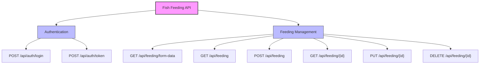

# API Structure Diagram

```mermaid
graph TD;
    A["Fish Feeding API"] --> B["Authentication"]
    A --> C["Feeding Management"]
    B --> D["POST /api/auth/login"]
    B --> E["POST /api/auth/token"]
    C --> F["GET /api/feeding/form-data"]
    C --> G["GET /api/feeding"]
    C --> H["POST /api/feeding"]
    C --> I["GET /api/feeding/{id}"]
    C --> J["PUT /api/feeding/{id}"]
    C --> K["DELETE /api/feeding/{id}"]
    
    style A fill:#f9f,stroke:#333,stroke-width:2px
    style B fill:#bbf,stroke:#333,stroke-width:1px
    style C fill:#bbf,stroke:#333,stroke-width:1px
``` 