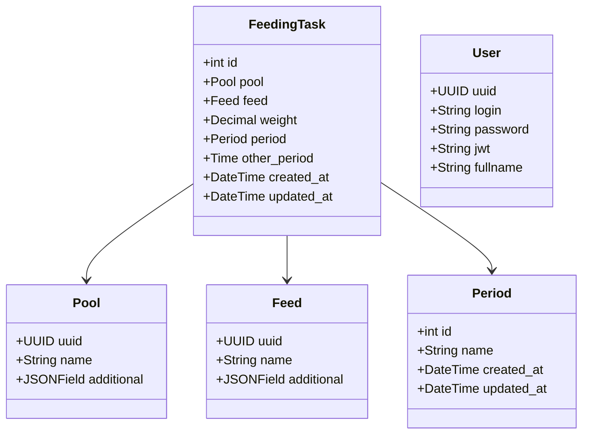

# Data Models Diagram

```mermaid
classDiagram
    class Pool {
        +UUID uuid
        +String name
        +JSONField additional
    }
    
    class Feed {
        +UUID uuid
        +String name
        +JSONField additional
    }
    
    class Period {
        +int id
        +String name
        +DateTime created_at
        +DateTime updated_at
    }
    
    class FeedingTask {
        +int id
        +Pool pool
        +Feed feed
        +Decimal weight
        +Period period
        +Time other_period
        +DateTime created_at
        +DateTime updated_at
    }
    
    class User {
        +UUID uuid
        +String login
        +String password
        +String jwt
        +String fullname
    }
    
    FeedingTask --> Pool
    FeedingTask --> Feed
    FeedingTask --> Period
``` 