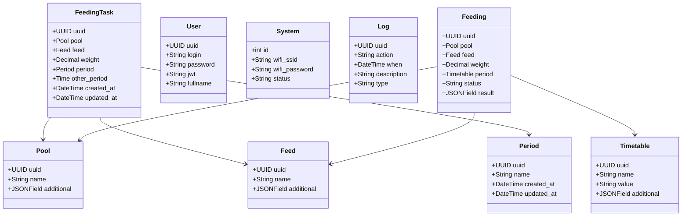

# Data Models Diagram

```mermaid
classDiagram
    class Pool {
        +UUID uuid
        +String name
        +JSONField additional
    }
    
    class Feed {
        +UUID uuid
        +String name
        +JSONField additional
    }
    
    class Period {
        +UUID uuid
        +String name
        +DateTime created_at
        +DateTime updated_at
    }
    
    class FeedingTask {
        +UUID uuid
        +Pool pool
        +Feed feed
        +Decimal weight
        +Period period
        +Time other_period
        +DateTime created_at
        +DateTime updated_at
    }
    
    class User {
        +UUID uuid
        +String login
        +String password
        +String jwt
        +String fullname
    }
    
    class System {
        +int id
        +String wifi_ssid
        +String wifi_password
        +String status
    }
    
    class Log {
        +UUID uuid
        +String action
        +DateTime when
        +String description
        +String type
    }
    
    class Timetable {
        +UUID uuid
        +String name
        +String value
        +JSONField additional
    }
    
    class Feeding {
        +UUID uuid
        +Pool pool
        +Feed feed
        +Decimal weight
        +Timetable period
        +String status
        +JSONField result
    }
    
    FeedingTask --> Pool
    FeedingTask --> Feed
    FeedingTask --> Period
    Feeding --> Pool
    Feeding --> Feed
    Feeding --> Timetable
``` 